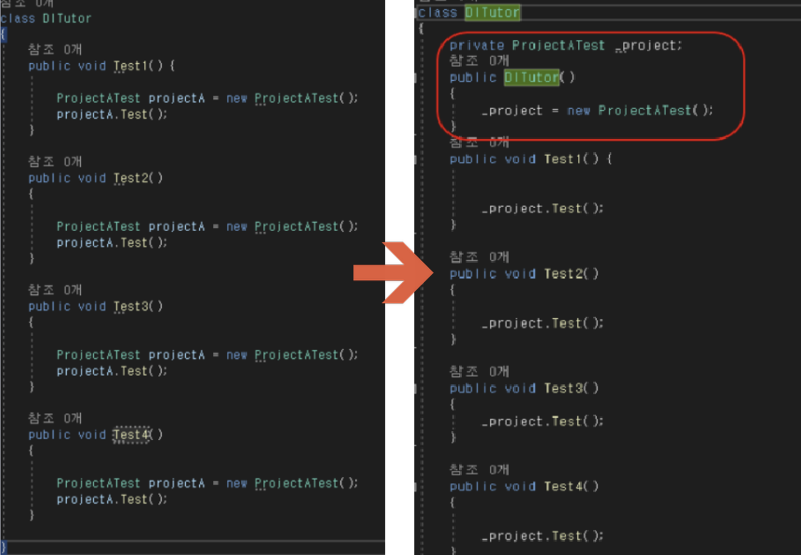
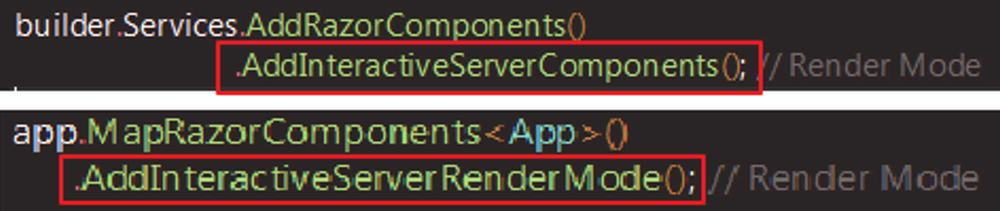
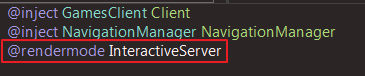

### 목차
- [기초 지식](#기초지식)
- [의존성 주입](#의존성-주입)
- [Render Modes](#Render-Modes)
- [비동기 작업 수행](#비동기-작업-수행)
- [endpoints](#endpoints)
- [ToListAsync()](#ToListAsync())
- [@bind](#@bind)

<br />
<br />
<br />

# 기초지식  
## **@page directive**

```csharp
@page "/counter"
```

- URL 경로를 페이지에 매핑하는 역할
- @page directive에 의해 웹브라우저가 /counter 페이지를 요청했을 때 해당 컴포넌트가 페이지에 그려짐 = 해당 URL에 매핑된 Blazor 컴포넌트가 브라우저에 렌더링되어 사용자가 볼 수 있는 콘텐츠로 표시

<br/>

## **@onclick**

```csharp
<button class="btn btn-privary" @onclick="IncrementCount">Click me</button>
```

- 버튼 클릭 시 @onclick에 연결된 IncrementCount  메서드가 실행됨

<br/>

## [Parameter]

```csharp
@code{
    private int currentCount = 0;
    
    [Parameter]
    public int IncrementAmount { get; set; } = 1;
    
    private void IncrementCount() 
    {
        currentCount += IncrementAmount;
    }
}
```

```csharp
<Counter IncrementAmount="10">
```

- 외부에서 값을 전달받는 데 사용되는 매개변수를 정의할 때 사용
- 이 매개변수는 컴포넌트의 속성으로 정의되고, 컴포넌트를 사용하는 곳에서 해당 속성에 값을 전달할 수 있음
- Parameter는 외부에서 값을 전달받아 컴포넌트의 동작을 제어하는데 사용되는 중요한 개념

<br/>

## @code

```csharp
@code{
    List<PizzaSpecial> specials;
}
```

- C# 코드를 작성하는 데 사용됨
- **@code 블록의 역할**
    1. 컴포넌트의 상태 관리 
        1. 데이터 유지, 업데이트
        2. 주로 컴포넌트의 필드나 속성을 선언해 상태를 저장하고 관리
    2. 이벤트 핸들링
        1. 사용자의 입력에 대응해 이벤트 핸들러를 정의 가능
        2. 버튼클릭, 텍스트 입력 등의 이벤트에 대한 처리를 구현 
    3. 컴포넌트의 속성 정의
        1. 컴포넌트의 속성을 정의해 외부에서 컴포넌트에 값을 전달할 수 있음
        2. **`@code`** 블록 내에서 **`[Parameter]`** 속성을 사용하여 외부에서 전달된 값을 받을 수 있음
    4. 컴포넌트의 라이프사이클 이벤트 처리
        1. 컴포넌트가 초기화/업데이트/제거될 때 등의 이벤트에 대한 처리를 구현 가능
    5. 메서드 및 함수 정의
        1. 필요한 기능을 수행하기 위한 메서드나 함수를 정의 가능
        2. 컴포넌트의 로직을 구현하는데 사용됨
      
<br/>

## @inject

- 작성된 컴포넌트에 서비스를 주입하는 데 사용됨
- 의존성 주입(Dependency Injection)을 이용하여 컴포넌트가 필요로 하는 서비스를 외부에서 주입 가능

```csharp
@inject SomeServiceName SomeServiceInstance

<h1>Some Service Example</h1>

<p>Service Value: @SomeServiceInstance.SomeValue</p>

@code {
    // 필요에 따라 컴포넌트 로직을 작성합니다.
}
```

- **`SomeServiceName`**은 주입하려는 서비스의 유형,
  **`SomeServiceInstance`**는 해당 서비스의 인스턴스
  이를 통해 컴포넌트 내에서 주입된 서비스를 사용할 수 있음
  
- 사용되는 경우
    1. 서비스 주입
        1. 컴포넌트가 필요로 하는 서비스를 주입하기 위해 사용됨
        2. 주로 데이터베이스 컨텍스트, HTTP 클라이언트, 로깅 서비스 등의 서비스를 주입 
    2. 서비스 사용
        1. 주입된 서비스를 사용해 컴포넌트의 로직을 구현하고 실행 가능
        2. 주입된 서비스를 필드 또는 속성으로 선언해 사용 가능
    
<br/>

## OnInitializedAsync

- 컴포넌트의 생명주기(lifecycle) 메서드 중 하나
- 컴포넌트가 초기화되고 처음 렌더링될 때 호출되는 비동기 메서드
- 컴포넌트가 렌더링되기 전에 비동기 작업을 수행할 수 있도록 해
- **`OnInitializedAsync`** 메서드는 **`ComponentBase`** 클래스에서 상속된 메서드이며, Blazor 컴포넌트 클래스에서 재정의하여 사용 가능

```csharp
@code {
    List<PizzaSpecial> specials;
    
    protected override async Task OnInitializedAsync()
    {
        specials = await HttpClient.GetFromJsonAsync<List<PizzaSpecial>>("specials");
    }
}
```

- **`OnInitializedAsync`** 메서드는 컴포넌트가 렌더링되기 전에 호출,
여기서 수행하는 작업은 컴포넌트의 초기화 단계에서 필요한 모든 준비 작업을 수행할 수 있도록 함

- 사용 예
    1. 데이터 로딩
        1. 컴포넌트가 초기화될 때 비동기적으로 데이터를 로딩해 초기 상태를 설정 가능
        2. 데이터베이스에서 데이터를 가져오거나 원격 API로부터 데이터를 로드하는 등의 작업을 수행 가능
    2. 서비스 초기화
        1. 컴포넌트가 초기화될 때 서비스를 초기화하거나 필요한 서비스를 주입받을 수 있음
        2. 필요한 서비스가 비동기적으로 초기화되는 경우에 유용함
    3. 사용자 설정 로딩
        1. 컴포넌트가 초기화될 때 사용자 설정을 비동기적으로 로드해 화면에 표시 가능
        2. 사용자 설정이나 구성 정보를 비동기적으로 로딩하는 경우에 사용 가능
    4. 기타 비동기 작업
        1. 컴포넌트가 초기화될 때 수행해야 하는 기타 비동기 작업을 수행 가능
        2. 예) 비동기적으로 외부 리소스를 초기화하는 경우에 사용 
        
<br/>

## Layout

- 여러 페이지에서 공통적으로 사용되는 요소들을 정의하는데 사용함
- 일반적으로 사이트의 헤더, 푸터, 네이게이션 메뉴 등과 같이 여러 페이지에서 반복되는 요소들을 정의할 때 사용
- Razor 파일 형식으로 작성되며, **`_Layout.cshtml`**이라는 파일 이름을 사용
    
    ```csharp
    @inherit LayoutComponentBase
    
    <!-- 페이지 컨텐츠 섹션 -->
        <div class="content">
            @Body
        </div>
    
    <!-- 페이지 푸터 섹션 -->
        <footer>
            &copy; 2024 - My Blazor App
        </footer>
    ```
    
    - **`@Body`**는 Blazor의 페이지 컴포넌트의 컨텐츠로 각 페이지 컴포넌트의 내용이 여기에 렌더링 됨(각 페이지의 고유한 컨텐츠는 Page 컴포넌트에 정의)
    - 코드의 중복을 줄이고 유지보수를 용이하게 함

<br/>

## Router

- 사용자의 요청에 따라 적절한 컴포넌트를 렌더링하는 역할을 함
- URL 경로와 해당 경로에 매핑된 Blazor 컴포넌트 간의 연결을 관리하고 사용자가 요청한 경로에 따라 컴포넌트를 표시함
- Blazor에서 기본 라우터는 **`Router`**라는 빌트인 컴포넌트로 제공
        ⇒ **`Router`** 라이브러리에서 제공되며, **`App.razor`** 파일에 사용됨

```csharp
<Router AppAssembly="@typeof(Program).Assembly">
    <Found Context="routeData">
        <RouteView RouteData="@routeData" DefaultLayout="@typeof(MainLayout)" />
    </Found>
    <NotFound>
        <p>페이지를 찾을 수 없습니다.</p>
    </NotFound>
</Router>
```

- **`RouteView`** 컴포넌트는 현재 요청된 URL에 해당하는 페이지 컴포넌트를 렌더링
만약 요청된 URL에 매핑된 페이지가 없으면 **`NotFound`** 영역이 렌더링
- 기능
    1. 라우팅
        1. 라우터는 URL 경로와 해당 경로에 매핑된 Blazor 컴포넌트 간의 연결을 설정
        2. 사용자가 특정 URL을 요청하면 해당 URL에 매핑된 컴포넌트를 렌더링 
    2. 동적 경로
        1. 라우터는 동적으로 경로를 생성 가능
        2. **`@page "/products/{id}"`**와 같이 경로를 정의하여 변수를 사용할 수 있음
            
            ⇒ 동적으로 변경되는 요청에 대응 가능
            
    3. 중첩 라우터 
        1. 라우터는 중첩이 가능
        2. 하위 컴포넌트 내에서 또 다른 라우터를 사용해 중첩된 페이지 구조 생성 가능
    4. 라우터 이벤트
        1. 라우팅 이벤트 처리 가능
        2. 라우터 이벤트를 사용해 라우팅 전/후에 특정 작업을 수행 가능함 
    
<br/>

## NavLink
    
- 일반적으로 사용자가 클릭해 다른 페이지로 이동할 때 사용
- **`NavLink`**는 URL 경로에 따라 활성 상태를 표시하고 클릭할 때마다 해당 경로로 이동
- **`NavLink`**라이브러리에서 제공되며, Blazor 애플리케이션에서 사용하기 위해서는 해당 라이브러리를 먼저 설치해야 함
- 네비게이션 링크 컴포넌트로,  anchor 태그와 유사하나 현재 URL과 일치하는 지에 따라 active 클래스가 활성화 됨
    
    ```csharp
    <NavLink href="/counter" Match="NavLinkMatch.All ">Counter</NavLink>
    ```
    
    - NavLinkMatch.All == 전체 URL이 일치할 때만 active 되는 것을 의미

<br/><br/>

# 의존성 주입

## 의존성(Dependancy Injection) 주입이란?
DI는 의존성을 관리하고 필요한 객체 또는 서비스를 컴포넌트에 주입하는 프로세스를 의미 
<i>다른 개체를 수신하는 매커니즘(수신개체:클라이언트 / 전달되거나 주입된 개체:서비스)</i>
이를 통해 Blazor 애플리케이션에서는 외부 서비스, 데이터 리포지토리, 설정 등과 같은 객체 또는 서비스에 쉽게 액세스 가능
<br/><br/>


## 의존성 주입 방법
주로 두 가지 방법으로 이루어짐
  1. <b>생성자 주입(Constructor Injection)</b>: 컴포넌트의 생성자에 의존성을 주입하여 해당 컴포넌트에서 사용할 수 있도록 함
                                               가장 일반적인 의존성 주입 방식으로, 컴포넌트가 생성될 때 필요한 의존성이 자동으로 주입됨

  2. <b>서비스 주입(Service Injection)</b>: '@inherit'디렉티브를 사용해 컴포넌트에 서비스를 주입
                                            생성자 주입과 유사하지만, <b>주입할 서비스를 개별적으로 명시</b>해야 함

의존성 주입을 사용하면 컴포넌트가 외부 리소스에 대해 느슨하게 결합되어 유지 보수성과 테스트 용이성이 향상됨.
또한, 애플리케이션의 다양한 부분에서 동일한 서비스 인스턴스를 공유하여 리소스 사용을 최적화할 수 있음
<br/><br/>


## 의존성 주입을 위한 다양한 수명주기
  1. <b>Scoped</b> : 범위가 지정된 수명 주기는 범위내에서 유효(예: Http 요청)
                     각 HTTP 요청마다 새로운 범위가 생성되고, 해당 범위 내에서만 서비스의 인스턴스가 유지됨 == HTTP 요청마다 서비스 인스턴스가 생성되고, 같은 요청 범위 내에서는 동일한 인스턴스가 공유된다는 것을 의미 
                     이는 데이터베이스 컨텍스트나 사용자의 세션과 같이 HTTP 요청 범위 내에서 상태를 유지해야 하는 서비스에 유용함.
  
  2. <b>Singleton</b> : 단일 인스턴스를 갖게 되며 모든 객체에 대해 동일한 인스턴스가 공유됨 
                        즉, 한 번 생성된 서비스 인스턴스는 애플리케이션 전체에서 공유되며, 애플리케이션이 실행되는 동안 계속 유지됨
                        애플리케이션 전체에서 공통으로 사용되는 상태나 설정과 같은 서비스에 적합함
        
  
  3. <b>Transit</b> : 일시적으로 서비스가 요청될 때마다 새 인스턴스가 생성됨 == 매번 서비스가 요청될 때마다 새로운 인스턴스가 생성되고 반환된다는 것을 의미 
                      이는 매번 새로운 상태를 가져야 하는 서비스나 서비스가 가벼운 상태를 가지고 있는 경우에 적합

의존성 주입을 위한 다양한 수명 주기를 이해하면 애플리케이션의 동작 및 성능을 최적화하는 데 도움이 됨 
적절한 수명 주기를 선택하여 서비스를 구성하면 자원을 효율적으로 관리하고 애플리케이션의 성능을 향상시킬 수 있음
<br/><br/>

## 의존성 정리
### 의존성이란? 
메소드끼리 끈끈하게 엮인 관계 = 하나가 바뀌면 일일히 다 수정해줘야 함

1. 생성자(Constructor)를 통해 의존성을 낮출 수 있음 
    
    
    - 생성자에서 한번 객체를 생성한 후 전역변수를 통해 각 메소드에게 할당하는 방식
    
    
2. 의존성 주입
- 실제로 쓰는 방식은 객체생성은 X고 객체를 생성자 인자로 받음
- 이는 프레임워크 단에서 필요시 
자동으로 객체를 생성해 인자로 던져주는 기능을 해주기 때문임
- 현재 작동시키는 클래스 내부가 아닌 외부에서 객체를 생성한 후 그 객체를 제공하는 기술이 바로 의존성 주입(Dependency injection)

<br/><br/>

# Render Modes
## 의미 
컴포넌트가 렌더링되는 방식
<b>1. Statiic Server-Side Rendering(정적 서버 측 렌더링)</b>
- 웹 페이지의 모든 컨텐츠를 서버 측에서 렌더링하여 브라우저에 보내는 방식
- 클라이언트 측에서는 서버에서 받은 HTML, CSS 및 JavaScript 파일을 렌더링하고 표시함
- 초기 로딩시간을 최소화하고 검색 엔진 최적화를 개선
    
<b>2. Interactive Server-Side Rendering(대화형 서버 측 렌더링)</b>
- 초기 페이지 로드 시에는 서버 측에서 렌더링되지만, 이후 사용자와의 상호 작용에 따라 일부 컨텐츠를 서버 또는 클라이언트 측에서 동적으로 업데이트하는 방식
- 초기 로딩 시간을 최소화하고 동시에 사용자 경험을 개선
    
<b>3. Client-Side Rendering(클라이언트측 렌더링 - WebAssembly)</b>
- 웹 페이지의 모든 렌더링을 브라우저에서 처리하는 방식
- 서버는 클라이언트에 필요한 데이터만 제공하고, 클라이언트에서는 이 데이터를 이용해 UI를 동적으로 렌더링 함
- 빠른 페이지 전환과 사용자 경험을 제공할 수 있지만, 초기 로딩 시간은 느릴 수 있음
    
<b>4. Automatic Rendering(자동 렌더링)</b>
- 렌더링 방식이 자동으로 선택되는 방식
- 사용자 경험을 최적화
- 개발자가 수동으로 렌더링 방식을 선택할 필요없음
    

## 사용방법
1. program.cs
 

        
2. 렌더링이 필요한 페이지



# 비동기 작업 수행
## 정의
비동기 작업 수행(Performing Asynchronous Work)은 프로그램이 동시에 여러 작업을 처리할 수 있도록 하는 프로그래밍 패턴 또는 기술
특히 입출력(IO) 작업(예: 파일 또는 네트워크에서 데이터 읽기/쓰기)이나 장기 실행 작업(예: 데이터베이스 쿼리)을 수행할 때 유용함

## 도입 배경
기본적으로 프로그램은 작업을 순차적으로 실행하기 때문에 한 작업이 완료되기 전까지 다음 작업을 수행할 수 없음. 이는 입출력 작업이나 데이터베이스 쿼리와 같은 작업이 완료될 때까지 프로그램이 대기해야 한다는 의미로 시스템의 성능을 저하시킬 수 있음
이러한 문제를 해결하기 위해 비동기 작업이 도입됨

비동기 작업은 한 작업이 완료될 때까지 기다리지 않고 다른 작업을 수행할 수 있음
따라서 입출력 작업이나 장기 실행 작업을 수행하는 동안 다른 작업을 수행할 수 있고, 이는 프로그램의 반응성과 성능을 향상시킴

## 구현
C#에서 비동기 작업은 **`async`** 및 **`await`** 키워드를 사용하여 구현
**`async`** 키워드는 해당 메서드가 비동기 작업을 수행한다는 것을 나타내며, 
**`await`** 키워드는 비동기 작업의 완료를 기다리고 해당 작업이 완료될 때까지 실행을 일시 중단

## 예시
- 파일을 읽는 비동기 메서드
    
    ```csharp
    using System.IO;
    using System.Threading.Tasks;
    
    public async Task<string> ReadFileAsync(string filePath)
    {
        using (StreamReader reader = new StreamReader(filePath))
        {
            return await reader.ReadToEndAsync();
        }
    }
    ```
    
    - `ReadFileAsync` 메서드는 파일을 비동기적으로 읽고 해당 파일의 내용을 문자열로 반환
    - `await reader.ReadToendAsync()` 구문은 파일 읽기 작업이 완료될 때까지 대기하고, 파일이 읽혀진 후에 다음 작업을 계속함

# endpoints
## 정의

일반적으로 웹 애플리케이션에서 특정 기능 또는 서비스에 대한 접근 지점을 가리킴
보통 HTTP 요청을 처리하고 해당 요청에 대한 응답을 반환하는 URL 및 메서드(예: GET, POST, PUT, DELETE)를 정의함

[ASP.NET](http://asp.net/) Core와 같은 프레임워크에서는 엔드포인트를 사용하여 웹 애플리케이션의 라우팀을 구성하는데 엔드포인트는 URL 패턴과 HTTP 메서드를 요청 처리 로직에 매핑시킴
이를 통해 클라이언트는 특정 URL로 요청을 보내고, 서버는 해당 요청을 처리하고 응답을 반환

예를 들어, "/users"라는 엔드포인트는 사용자 정보를 관리하는 기능에 대한 접근 지점, 클라이언트는 HTTP GET 요청을 사용하여 "/users" 엔드포인트에 요청을 보내고, 서버는 해당 요청에 대한 응답으로 사용자 목록을 반환할 수 있음.


# ToListAsync()
## 정의

**`ToListAsync()`** 메서드는 Entity Framework Core에서 제공하는 메서드로, LINQ 쿼리 결과를 비동기적으로 리스트로 변환해주는 역할

## 역할

- LINQ 쿼리의 결과를 메모리에 로드하기 위해 사용되는데 데이터베이스에서 쿼리를 실행하여 결과를 가져온 다음에 해당 결과를 메모리에 있는 리스트로 변환
이때 **`ToListAsync()`** 메서드는 비동기적으로 실행되므로 데이터베이스 작업이 완료될 때까지 스레드를 차단하지 않고 다른 작업을 수행할 수 있음
- **`ToListAsync()`** 메서드를 호출하여 데이터베이스에서 테이블의 모든 레코드를 비동기적으로 가져오고, 그 결과를 **`List<>`** 형태로 반환합니다. 이렇게 함으로써 **`Get_()`** 메서드는 데이터베이스에서 모든 아이디어를 가져오는 역할을 수행함


# @bind
## 정의
**`@bind`**와 **`@bind-Value`**는 Blazor에서 데이터 바인딩을 설정하는 데 사용되는 두 가지 방법
기능적으로 유사하지만 사용 시기와 사용방법에 약간의 차이가 존재

### 1. @bind

- 속성을 자동으로 바인딩하는 단축 구문
- 속성과 연결된 변수가 변경되면 해당 속성의 값을 업데이트하고, 사용자가 속성의 값을 변경하면 변수를 업데이트
- 사용예시
    - `@bind`를 사용해 입력요소와 변수를 바인딩 할 수 있음
        > `myVariable` 은 사용자 입력에 따라 업데이트 됨
    
    ```csharp
    <input type="text" @bind="myVariable" />
    ```
    

### 2. @bind-Value

- 명시적으로 요소의 값을 바인딩
- 주로 사용자 지정 컴포넌트나 특정 상황에서 필요한 경우에 사용됨
- 단순한 상황에서 사용되는 `@bind` 와 달리 `@bind-Value`는 일반적으로 복합적인 상황에서 사용됨
- 사용예시
    > 사용자 지정 컴포넌트의 내부적인 데이터 속성과 사용자가 입력한 값 간의 연결을 설정할 때 사용될 수 있음
        => 사용자가 `CustonComponent` 에서 값을 변경할 때마다  `myVariable` 의 값도 업데이트 됨
    
    ```csharp
    <CustomComponent @bind-Value="myVariable" />
    ```
    

### 3. @bind:event="oninput”

- 데이터 입력 요소와 데이터 속성을 양방향으로 바인딩할 때 사용되는 옵션 중 하나
- 입력요소의 `input` 이벤트가 발생할 때마다 데이터를 업데이트하도록 지정
- 기본적으로 Blazor는 데이터 바인딩이 요소의 `change` 이벤트에 의해 발생하는데 사용자가 입력 필드에서 값을 변경하고 포커스를 잃을 때 발생하는 이벤트
- `@bind:event="oninput"`을 사용하면 입력 필드에 값을 입력할 때마다 데이터가 즉시 업데이트되기 때문에 사용자 경험을 향상시키고, 실시간으로 입력 내용을 반영할 때 유용
- 사용 예시
    > 사용자가 입력 필드에 값을 입력할 때마다 `myVariable`의 값이 실시간으로 업데이트
     ```csharp
    <input type="text" @bind="myVariable" @bind:event="oninput" />
    ```


